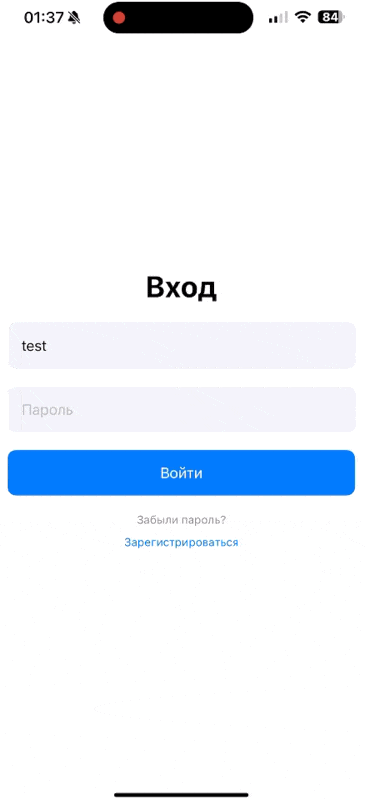
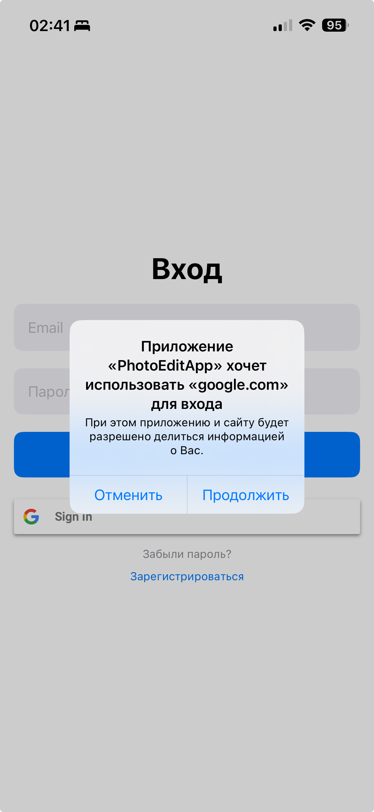
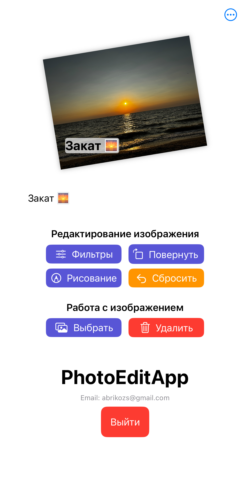
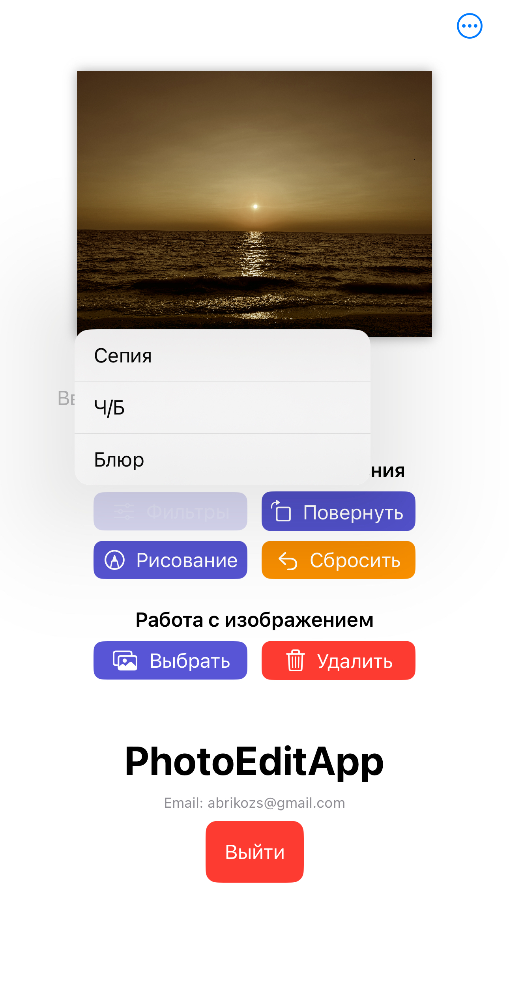
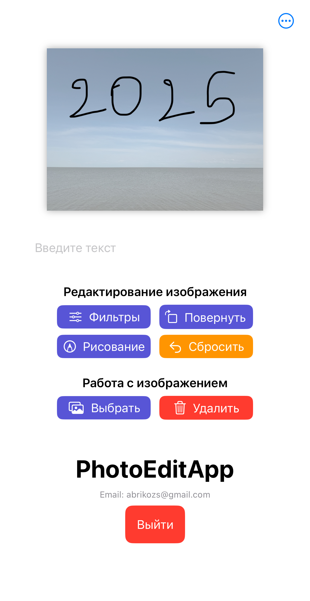
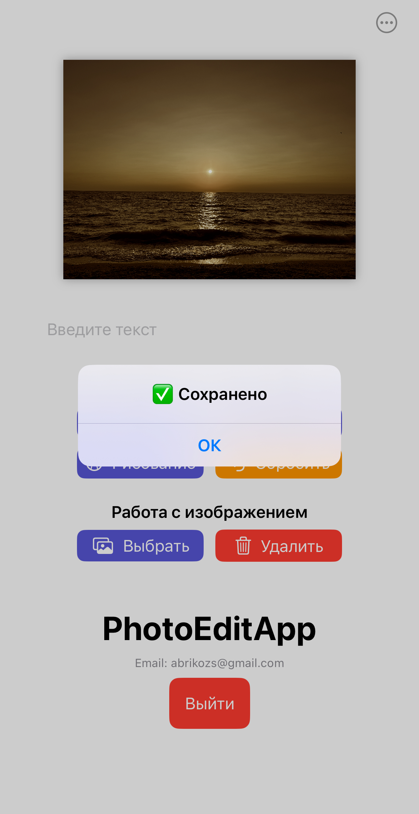
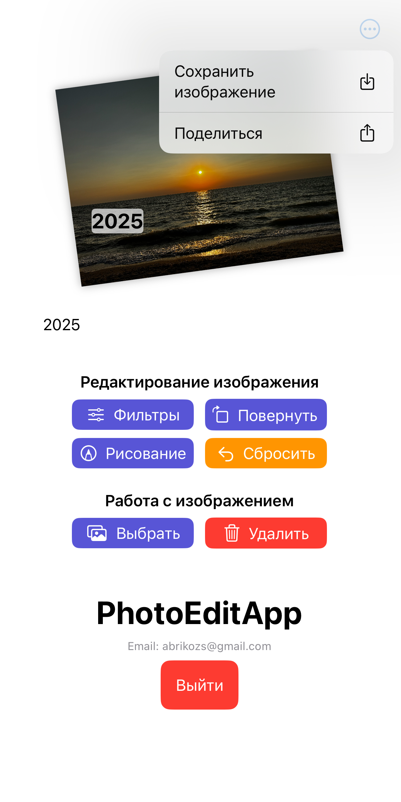

# 📱 PhotoEditApp

> 🔐 Firebase Auth + Google Sign-In  
> 🎨 Фото + текст + фильтры + рисование  

**PhotoEditApp** — простое iOS-приложение для редактирования изображений с авторизацией.  
Разработано как тестовое задание с использованием **SwiftUI**, **Firebase** и архитектуры **MVVM**.

## 📋 Описание тестового задания

**Цель:** разработать iOS-приложение с авторизацией и инструментами редактирования изображений.

**Основные требования:**

- Авторизация через **email/пароль** и **Google Sign-In**
- Простая регистрация и сброс пароля
- Редактирование фото с возможностью:
  - Масштабирования, поворота, перемещения
  - Добавления текста и рисования (PencilKit)
  - Применения фильтров CoreImage
- Сохранение и экспорт результата
- Стек: `Swift`, `SwiftUI`, `Firebase/Auth`, `GoogleSignIn`, `Combine`, `CoreImage`, `PencilKit`
- Архитектура: `MVVM`, соответствие Apple Human Interface Guidelines

**Ожидаемый результат:**

- Функционирующее приложение с понятным и адаптивным интерфейсом
- Структурированный код и повторно используемые компоненты
- README с описанием возможностей и архитектуры

---

## 🖼️ Скриншоты

| Вход (email) | Вход (Google) | Редактирование | Фильтры | Рисование | Сохранение | Экспорт |
|--------------|---------------|----------------|---------|-----------|------------|---------|
|  |  |  |  |  |  |  |
---

## ✨ Возможности

- ✅ Регистрация и вход по email/паролю  
- ✅ Вход через Google-аккаунт  
- ✅ Простая валидация форм (email, пароль)  
- ✅ Сброс пароля (заглушка)  
- ✅ Загрузка изображения из галереи  
- ✅ Сохранение изображения в `UserDefaults`  
- ✅ Отображение изображения между сессиями  
- ✅ Замена и удаление изображения  
- ✅ Масштабирование, поворот и перемещение изображения (жестами)  
- ✅ Наложение текста на изображение с перетаскиванием  
- ✅ Режим рисования поверх изображения (PencilKit)  
- ✅ Фильтры CoreImage (Sepia, Ч/Б, Blur)  
- ✅ Экспорт итогового изображения через Share Sheet  

---

## 🧱 Технологии

- `SwiftUI 5`
- `MVVM` архитектура
- `Firebase Auth`
- `PhotosPicker`
- `PencilKit` (через `UIViewRepresentable`)
- `CoreImage` (Sepia, Mono, Blur)
- `UIActivityViewController` (экспорт)
- `Combine`, `AppStorage`
- Кастомная валидация, анимации и error feedback

---
## 🧭 Архитектура

Проект реализован по принципу **MVVM**:
- `View` — отвечает за отображение и ввод
- `ViewModel` — хранит бизнес-логику и состояние
- `Model` / `Service` — работа с Firebase и фильтрами

Весь обмен между слоями реализован через `@StateObject`, `@Published`, `Combine` и `@AppStorage`.

---

## 🧪 Тестирование

Реализованы базовые юнит-тесты:
- `AuthValidatorTests` — проверка корректности email и пароля
- `ImageTransformTests` — масштабирование, поворот, объединение изображений

Написаны с использованием `XCTest` и покрывают ключевые функции ViewModel'ей и сервисов.

---

## 🚀 Установка

1. Склонируйте репозиторий
2. Откройте `.xcodeproj` в **Xcode 15 или выше** 
3. Настройте Firebase:
   - Перейдите в [Firebase Console](https://console.firebase.google.com/)
   - Откройте ⚙️ **Project Settings** → вкладка **iOS**
   - Нажмите **Download `GoogleService-Info.plist`**
   - Скопируйте файл в `PhotoEditApp/Services/`  
     ⚠️ Этот файл содержит ключи и **не входит в репозиторий**
4. Запустите проект на устройстве или симуляторе

---

## 🔧 Планы по доработке

- [ ] Сброс пароля через Firebase  
- [ ] Сохранение изображений в Firebase Storage  
- [ ] Хранение профиля пользователя в Firestore  
- [ ] Редактирование текста (шрифт, цвет, выравнивание)  
- [ ] Поддержка iPad и мультитач  
- [ ] Темы оформления и улучшение анимаций  

---

## 👨‍💻 Автор

**Роман Пшеничников**  
[GitHub](https://github.com/Stockholm19)

---

<strong>🇬🇧 English version</strong>

 

# 📱 PhotoEditApp

> 🔐 Firebase Auth + Google Sign-In  
> 🎨 Photos: text, filters, and drawing

**PhotoEditApp** is a simple iOS app for image editing with Firebase-based authentication.  
Built as a test project using **SwiftUI**, **MVVM**, and **Firebase Auth**.

---

## 📋 Test Assignment Summary

**Goal:** Develop an iOS application with user authentication and photo editing tools.

**Key Requirements:**

- Sign in via **email/password** and **Google account**
- Registration and password reset functionality
- Photo editing features including:
  - Scaling, rotation, and repositioning
  - Text overlay and freehand drawing (PencilKit)
  - Applying CoreImage filters (Sepia, Mono, Blur)
- Save edited images and export them
- Tech stack: `Swift`, `SwiftUI`, `Firebase/Auth`, `GoogleSignIn`, `Combine`, `CoreImage`, `PencilKit`
- Architecture: `MVVM`, UI should follow Apple Human Interface Guidelines

**Expected Result:**

- Fully working app with clean and intuitive interface
- Well-structured code with reusable components
- A documented `README.md` describing features and project architecture

---

## 🖼️ Screenshots

| Email Login | Google Sign-In | Editing | Filters | Drawing | Export |
|--------------|----------------|---------|---------|---------|--------|
|  |  |  |  |  |  |  |

---

## ✨ Features

- ✅ Email/password registration and login  
- ✅ Google Sign-In support  
- ✅ Basic email/password validation  
- ✅ Password reset (placeholder)  
- ✅ Load an image from the gallery  
- ✅ Store image locally using `UserDefaults`  
- ✅ Persist image across sessions  
- ✅ Replace or delete the image  
- ✅ Scale, rotate, and move the image using gestures  
- ✅ Add a text overlay with drag gesture  
- ✅ Drawing mode on top of the image (PencilKit)  
- ✅ Apply CoreImage filters (Sepia, Mono, Blur)  
- ✅ Export the final image via Share Sheet (UIActivityViewController)

---

## 🧱 Technologies

- `SwiftUI 5`  
- MVVM architecture  
- `Firebase Auth`  
- `PhotosPicker` (SwiftUI)  
- `PencilKit` via `UIViewRepresentable`  
- `CoreImage` (Sepia, Mono, Blur)  
- `UIActivityViewController`  
- `Combine`, `AppStorage`  
- Custom form validation, animations, and error handling

---

## 🧭 Architecture

The project follows the **MVVM** design pattern:
- `View` — handles UI rendering and user input
- `ViewModel` — manages business logic and state
- `Model` / `Service` — responsible for Firebase operations and image filters

Data flow between layers is managed using `@StateObject`, `@Published`, `Combine`, and `@AppStorage`.

---

## 🚀 Installation

1. Clone the repository  
2. Open the `.xcodeproj` file in **Xcode 15 or later**  
3. Configure Firebase:  
   - Visit [Firebase Console](https://console.firebase.google.com/)  
   - Go to ⚙️ **Project Settings** → iOS  
   - Download `GoogleService-Info.plist`  
   - Add it to `PhotoEditApp/Services/`  
     ⚠️ File is not included in repo (contains private keys)  
4. Run the app on a device or simulator  

---

## 🔧 Future Improvements

- [ ] Enable password reset via Firebase  
- [ ] Upload images to Firebase Storage  
- [ ] Store user profile in Firestore  
- [ ] Text editing: font, color, alignment  
- [ ] Support for iPad and multitouch  
- [ ] UI polish: theming and animations  

---

## 👨‍💻 Author

**Roman Pshenichnikov**  
[GitHub](https://github.com/Stockholm19)

