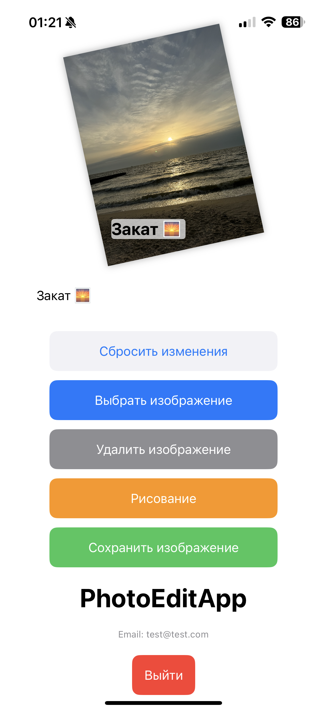
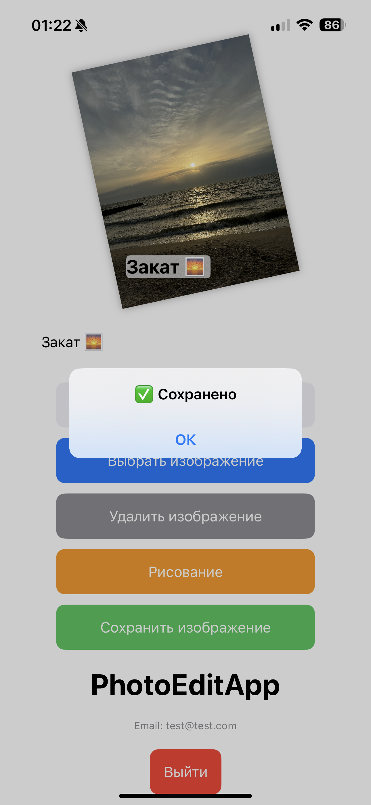
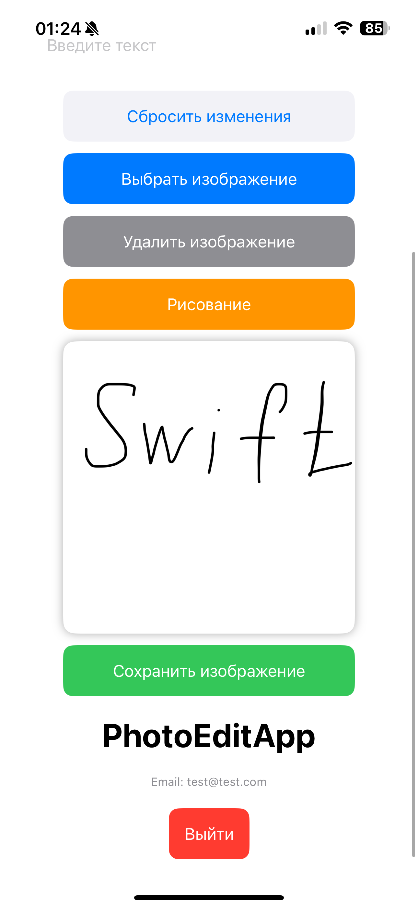

# 📱 PhotoEditApp

**PhotoEditApp** — простое iOS-приложение для редактирования изображений с авторизацией.  
Разработано как тестовое задание с использованием **SwiftUI**, **Firebase** и архитектуры **MVVM**.

---

## ✨ Возможности

- ✅ Регистрация и вход по email/паролю  
- ✅ Простая валидация форм (email, пароль)  
- ✅ Сброс пароля (заглушка)  
- ✅ Загрузка изображения из галереи  
- ✅ Сохранение изображения в `UserDefaults`  
- ✅ Отображение загруженного изображения между сессиями  
- ✅ Возможность заменить или удалить изображение  
- ✅ Масштабирование, поворот и перемещение изображения с помощью жестов  
- ✅ Наложение текста на изображение с возможностью перетаскивания  
- ✅ Режим рисования (отдельное холст-окно, пока без связи с изображением)  
- ✅ Сохранение отредактированного изображения в фотоальбом

---

## 🖼️ Скриншоты

| Логин/Регистрация | Редактирование | Сохранение | Рисование |
|-------------------|----------------|------------|-----------|
|  |  |  |  |

---

## 🧱 Технологии

- `SwiftUI 5`
- `MVVM` архитектура
- `Firebase Auth`
- `PhotosPicker` (SwiftUI)
- `PencilKit` (UIKit через `UIViewRepresentable`)
- `Combine`, `AppStorage`
- Кастомная валидация, анимации и error feedback

---

## 🚀 Установка

1. Склонируйте репозиторий  
2. Откройте `.xcodeproj` в **Xcode 15**  
3. Настройте Firebase и добавьте `GoogleService-Info.plist` в корень проекта  
4. Соберите и запустите на устройстве или симуляторе

---

## 🔧 Планы по доработке

- [ ] Сброс пароля через Firebase (реализовать отправку email)  
- [ ] Сохранение изображений в Firebase Storage  
- [ ] Хранение информации о пользователе в Firestore  
- [ ] Подключение Google Sign-In  
- [ ] Полноценная интеграция PencilKit (рисование прямо по изображению)  
- [ ] Фильтры редактирования изображений (CoreImage)  
- [ ] Редактирование текста (шрифт, цвет, выравнивание)  
- [ ] Поддержка iPad и мультитач  
- [ ] Улучшение UI/UX: темы, плавности, анимации

---

## 👨‍💻 Автор

**Роман Пшеничников**  
[GitHub](https://github.com/Stockholm19)

---

<strong>🇬🇧 English version</strong>

 

# 📱 PhotoEditApp

**PhotoEditApp** is a simple iOS application for image editing with basic authentication.  
It was developed as a test project using **SwiftUI**, **Firebase**, and the **MVVM** architecture.

---

## ✨ Features

- ✅ Email/password registration and login  
- ✅ Basic form validation (email and password)  
- ✅ Password reset (placeholder)  
- ✅ Select an image from the photo library  
- ✅ Save the selected image to `UserDefaults`  
- ✅ Image persists between sessions  
- ✅ Replace or delete the image  
- ✅ Scale, rotate, and move the image using gestures  
- ✅ Add text overlay with drag support  
- ✅ Drawing canvas (PencilKit, currently not bound to image)  
- ✅ Save the final edited image to the photo library

---

## 🖼️ Screenshots

| Login / Sign up | Editing | Saving | Drawing |
|------------------|---------|--------|---------|
|  |  |  |  |

---

## 🧱 Technologies

- `SwiftUI 5`  
- MVVM architecture  
- `Firebase Auth`  
- `PhotosPicker` (SwiftUI)  
- `PencilKit` (via `UIViewRepresentable`)  
- `Combine`, `AppStorage`  
- Custom form validation, animations, and error feedback

---

## 🚀 Installation

1. Clone the repository  
2. Open `.xcodeproj` in **Xcode 15**  
3. Set up Firebase and add `GoogleService-Info.plist`  
4. Build and run on a real device or simulator

---

## 🔧 Future Improvements

- [ ] Enable password reset via Firebase  
- [ ] Upload images to Firebase Storage  
- [ ] Store user info in Firestore  
- [ ] Add Google Sign-In  
- [ ] Fully integrate PencilKit (draw directly on image)  
- [ ] Apply image filters via CoreImage  
- [ ] Text styling: font, color, alignment  
- [ ] iPad support and multitouch  
- [ ] Improve UI/UX (themes, animations, polish)

---

## 👨‍💻 Author

**Roman Pshenichnikov**  
[GitHub](https://github.com/Stockholm19)

